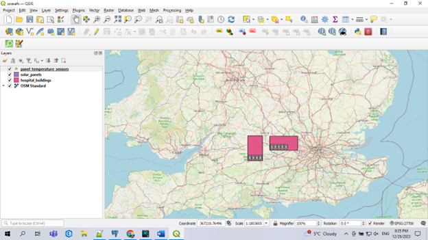
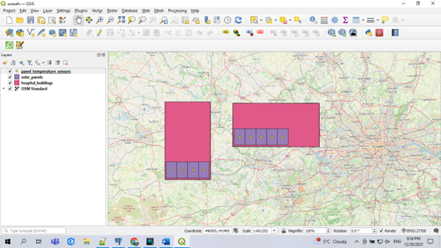
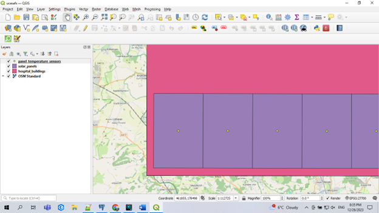
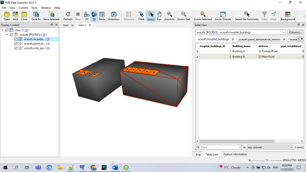
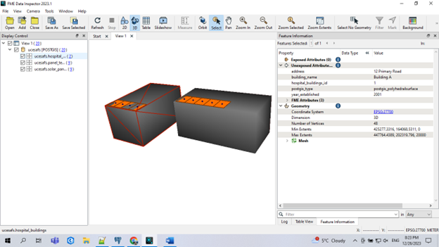

# 🌞 Hospital Solar Asset Management Database  

This repository contains a database designed for **asset management of solar panels in hospitals**. The database is built using **SQL, PostgreSQL, PostGIS, QGIS, and FME** and is based on **dummy data** (not from a real hospital).  

## 📌 Purpose  
The goal of this project is to assist asset managers in:  
- **Monitoring asset health** to ensure optimal solar panel performance.  
- **Supporting decision-making** on energy production, maintenance, and budgeting.  
- **Tracking asset details** such as location, condition, and installation date.  

## 🔍 Key Features  
- **Asset Health Monitoring** 🛠️: Detect faulty sensors and panels needing replacement.  
- **Energy Production Analysis** ⚡: Evaluate solar energy output and expansion feasibility.  
- **Budget & Cost Management** 💰: Estimate maintenance costs and budget allocations.  

## 📊 Example Use Cases  
- Identify **faulty temperature sensors** that need replacement.  
- Determine if **solar panels need renewal** based on condition and performance.  
- Analyze **annual energy production** to assess whether more panels are needed.  
- Estimate **budget requirements** for asset maintenance and replacements.  

## 🏛 Database Structure  
The database includes the following tables under the 'ucesafs' schema:  
- **hospital_buildings** 🏥 – Hospital facility information  
- **solar_panels** ☀️ – Solar panel assets  
- **panel_temperature_sensors** 🌡 – Temperature sensors  
- **solar_panel_values** 🔋 – Energy output tracking  
- **temperature_sensor_values** 📈 – Sensor temperature records  
- **solar_panel_condition** 🔎 – Panel physical condition reports  
- **parameters** ⚙️ – System parameters and thresholds  

## 🗺️ Technologies Used  
- **SQL & PostgreSQL** – Database management  
- **PostGIS** – Geospatial data integration  
- **QGIS** – Visualization and spatial analysis  
- **FME** – Data transformation and automation

## 📸 Visualizations  

### QGIS Visualizations  
*Visualization of solar panel locations within the hospital in QGIS, displaying asset location.*  

    
    
    

  

### FME Visualizations  
*Visualization of asset data transformation using FME, linking the solar panel data of PostgreSQL database to real-time condition and performance metrics.*  

    
    

  

🚀 **Feel free to explore and contribute!**  
